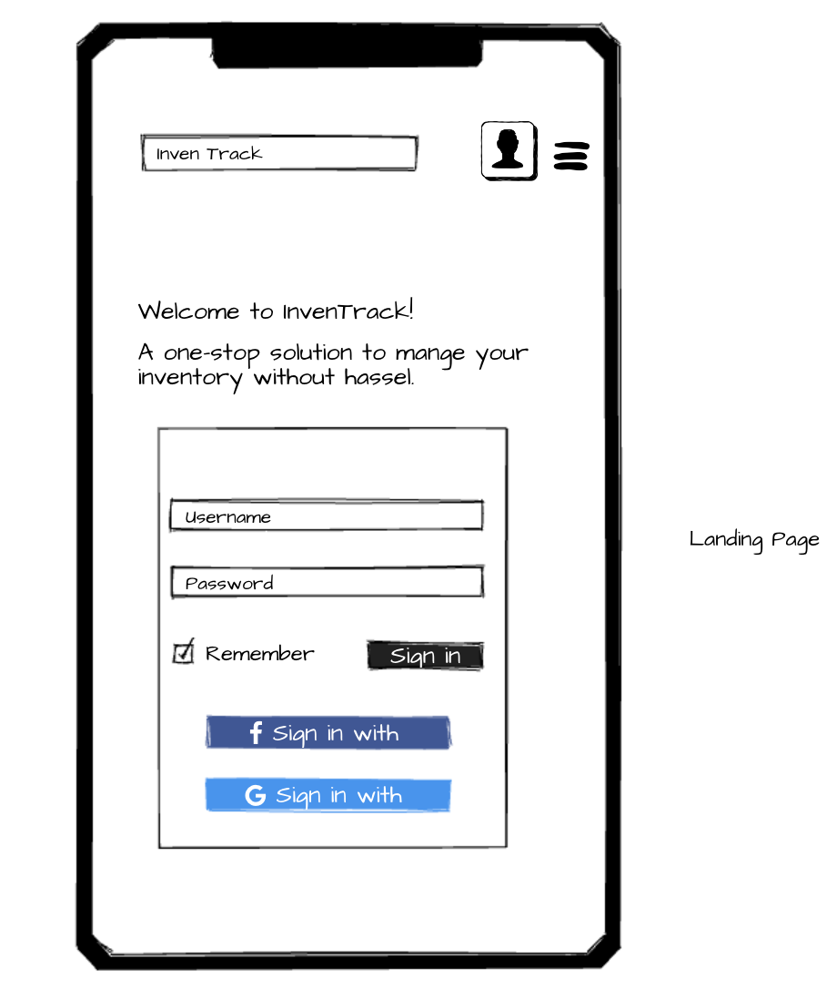
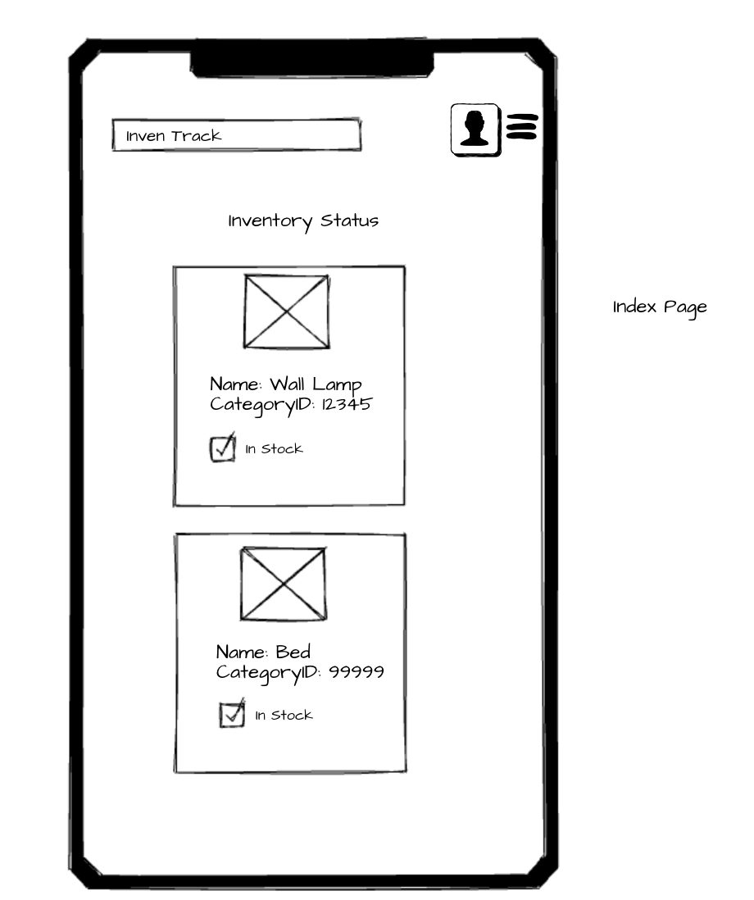
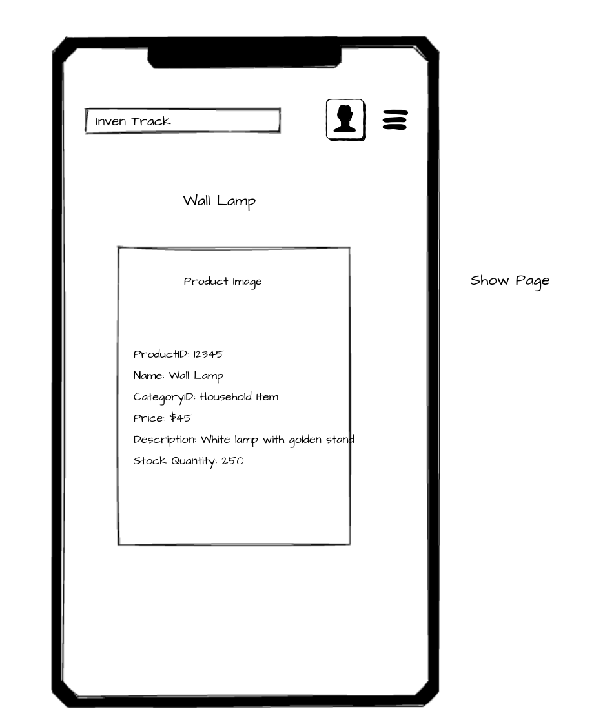
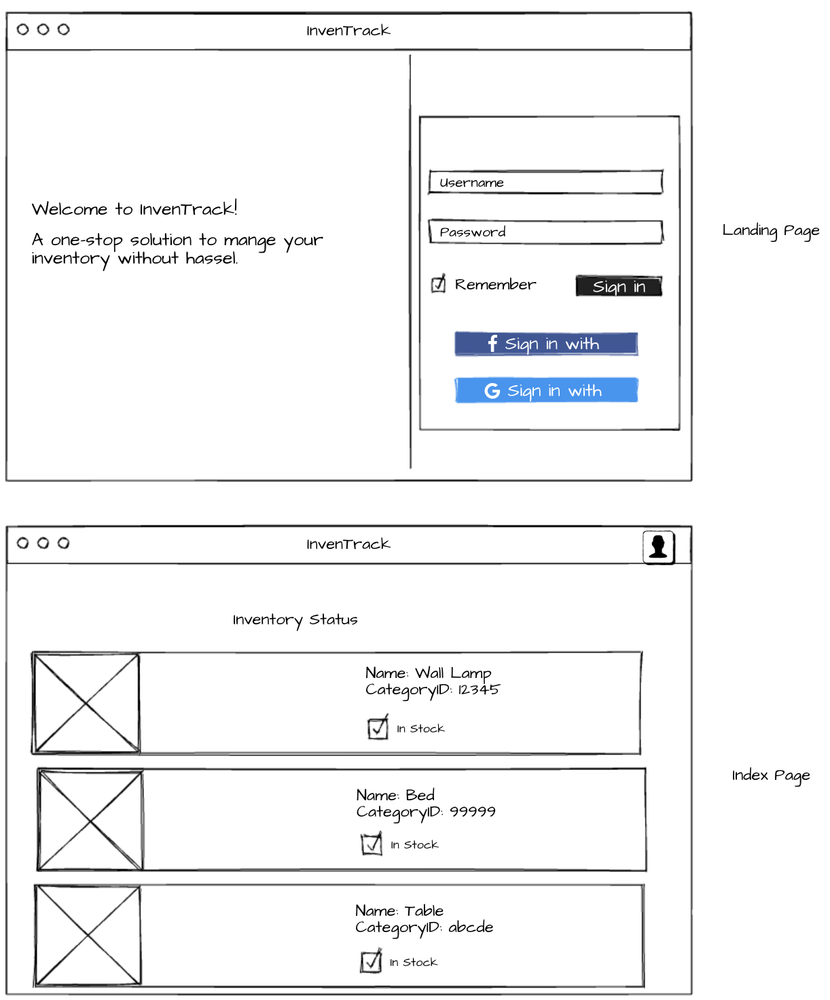
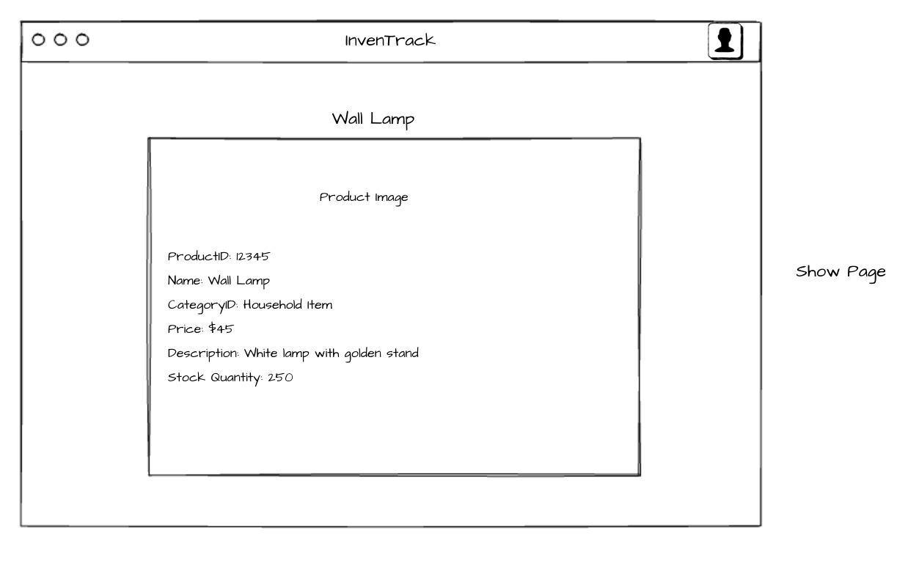
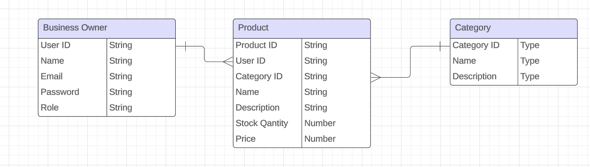

# Seal Project 2

- **Your Name:** Amrita Dutta
- **App Name:** InvenTrack
- **Description:** A full CRUD app that lets business owners manage their inventory effectively.
- **Github URL:** https://github.com/amritadutta25/project2
- **Deployed Website:** https://am-project2.onrender.com
- **Trello Board:** https://trello.com/b/aF2sKWQS/inventory-management-app

## List of Dependencies

##### Node Dependencies (package.json)

- express
- mongoose
- dotenv
- morgan
- method-override
- ejs
- bcrypt

##### Frontend (if used, ex. jquery, alpine, bootstrap, htmx, etc.)

- alpine
- jquery

## Route Map

Below should be a table listing the different routes in your app and their purposes.

### PRODUCT routes:
| Route Name | Endpoint | Method | Description |
|------------|----------|--------|-------------|
| Index | /products | GET | Renders all products on a page|
| New | /products/new | GET | Renders a form to create a new product|
| Delete | /products/:id | DELETE | Deletes a product from database|
| Update | /products/:id | PUT | Updates existing product|
| Create | /products | POST | Creates a new product|
| Edit | /products/:id/edit | GET | Renders a form to update an existing product |
| Show | /products/:id | GET | Renders a product on a page|

### USER routes:
| Route Name | Endpoint | Method | Description |
|------------|----------|--------|-------------|
| Signup form | /user/signup | GET | Renders a form to register a new user |
| Signup | /user/signup | POST | Register a new user |
| Login form | /user/login | GET | Renders a form to login existing user |
| Login | /user/login | POST | Login an existing user |

## Design Mockups (Desktop + Mobile)

##### Mobile Design

##### Desktop Design

## ERD (Entity Relationship Diagram)

This should be a diagram showing your models and any relationships between them.

## Beyond MVP:
- Send email notifications to business owners when stock is low
- Feature to place order of products running low in stock